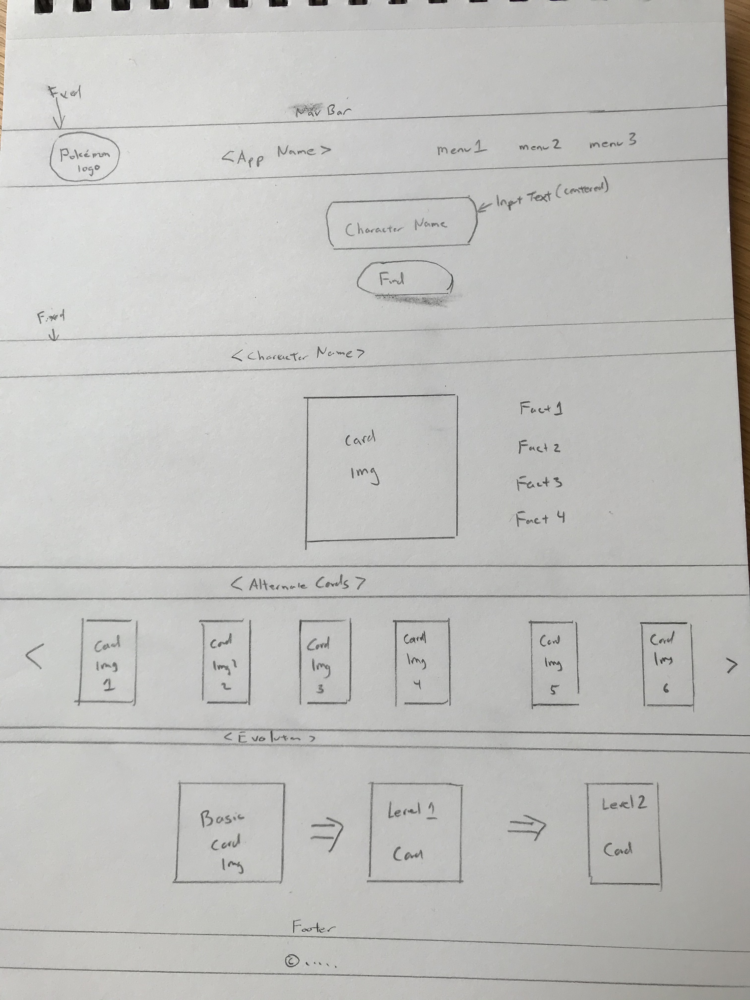

# Pokémon Card Finder

[Link to Pokémon Card Finder](http://pokemon-card-finder.surge.sh)

## Project Purpose:
Pokémon Card Finder was inpsired by my 8 year old son Alex, who just started to play Pokémon The Card Game (TCG).  He is always asking me about a specific card or character and asking me to google them.  He wants to know their health points, their attacks, who they evolve from, what other versions of the card exist and what resource do they use.  Pokémon Card Finder is build to answer all of his question.  All the user has to do is enter a name and they will get back all the information that they could want about that character.

## Technologies being used:
* HTML
* CSS
* JavaScript

## API to be used:
The [Pokémon TCG API] (https://pokemontcg.io/) is a free API that allows developers to easily consume Pokémon card data in JSON format.

## Features for MVP:

###Search section
Provide search functionality to user.

###Display primary(oldest) card 
Find the oldest Pokémon card associated with the character entered and display that card.  If a card is not found the user will get a modal stating that card was not found.

###Display Alternate cards
The same character could have multiple cards.  So in this section, display all other cards.

###Display Evolution Cards
Pokémon cards come in different levels: basic, level 1 and level 2.  Level 2 cards evolve from level 1 cards and level 1 cards evolve from basic cards.  So this section is meant to display that information in a visual form.

* If a user searches for a character that is a level 2 card, then this section will display the basic card, the level 1 card and the level 2 card.
* If a user searces for a character that is a level 1 card, then this section will display the basic card and the level 1 card.
* If a user searces for a basic card, this section will remain hidden.

## Stretch Goals:
* provide autocomplete functionality on the search bar.
* zoom modal when a user clicks on a card.

##Problem-solving approach
###For JavaScript
1. Console logging, console logging and more console logging.  Doing it meant I had to add a lot of code in to generate the logs and later pull that code out.  The more efficient way would have been to use the debugger but I wasn't comfortable enough with using the debugger. 
2. JSON viewer and Network tab in Chrome Developer Tools - both were crucial for testing out the API calls and understanding the response from the API call.
3. Google - to look up syntax.  Also useful to find potential solutions to problems that I didn't know how to solve.
3. Other SEI Dinos.
4. Walk away from the MacBook and come back later.

###For HTML and CSS
1. Chrome Developer Tools - That tool is amazing.  I used is all the time with page layout and css related things.  I really lets you see how each element sits on the page and the css associated with it.  The fact that it allows you to try things out and change the CSS on the screen was a huge time saver.
2. Google - to look up syntax.  Also useful to find potential solutions to problems that I didn't know how to solve.
3. Other SEI Dinos.
4. Walk away from the MacBook and come back later.

##Struggles you encountered and how you solved them
* CSS/HTML layout issues - On multiple occassions, I ran into issues with getting the page layout to look th way I wanted.  Sometimes it was trying to center the app name.  Other times it was getting certain elements to line up next to each other with not margin or padding.  Using Chrome Developer Tools was the way I was able to see what CSS was causing the issue and I was also able to test out potential fixes in the dev tools.

##Problems you weren’t able to solve
* API limits resultset to 100 items.  It's not really an issue when searching for individual characters but it did impact the way I build the search/filter dropdown.  Originally I wanted to call the API to get every character name in their API and build the dropdown off of that.  Due to the limit, I had to change plans and just have a representative sample of character names in the search/filter dropdown list.
* One of the stretch goals was to be able to click on a card image and then that would display a modal with an enlarged imange of the card.  Due to time constraints, I wasn't able to build that functionality out but it's something I want to do in the future.

##Code that you are proud of
###Search/Filter Dropdown
My original concept was to have the user type in the character name and search for it.  During the pitch meeting with Kahil, it became apparent that people may not know character names or how to spell the name.  One option was to have a search field and a dropdown list next to it but I didn't like that idea and how it would look/feel.  So I thought about some kind of auto-complete functionality on the input field.  That's when i/google found the [search/filter dropdown on w3school](https://www.w3schools.com/howto/howto_js_filter_dropdown.asp).  It looks like it's a searchable dropdown list but it's really a input tag with a bunch of a tags hidden underneath it.  And those a tags display/hide based on the value of the input text.  I read up on that and implemented it in my code.  I also wrote some JavaScrip to updated the list of items available in the a tag list.

## Wireframes:

